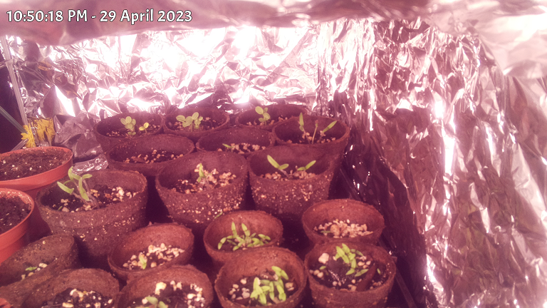

I've been known to do [gardening projects](https://www.youtube.com/playlist?list=PL_hT--4HOvrcGy7JYE1iRkAenFOI50r4x) that involve taking time-lapse photos of plants as they grow and compiling a video out of them. Sometimes it would be nice to overlay a timestamp on the video to show how much time is passing.

There's probably a way to do this with ffmpeg or my editing software, but I couldn't be bothered to learn how to do that so, as usual, I made GameMaker do it.

This is something that probably won't be at all useful unless you share my weirdly specific hobbies, but if any of you nerds have a use for it, I guess you can use it too.

# How to use

Run the program and select an image that belongs in the sequence you want to paste timestamps on. It'll read all of the image files out of the folder and process them all in batch.

It's probably pretty easy to just get the timestamps out of the file metadata, but as you've probably guessed I'm far too lazy to figure out how to do that.

Instead, the images come out of [my time lapse camera](https://github.com/DragoniteSpam/garden) with the following file name:

    pic_[YEAR]-[MONTH]-[DAY] [HH]_[MM]_[SS].[fraction].jpg

The program will extract the timestamp from the filename and draw it on the image.

If the files aren't named like this, the program will probably behave in a weird way, or maybe just crash.

The edited images will be saved in the `output` folder with the same name as the source files.

# Limitations

The output files will be saved as a PNG. This unfortunately is rather slow and PNG isn't the ideal file format for photographs, but unfortunately GameMaker is only currently capable of outputting PNG.

Maybe at some point I'll set this up to work with libjpeg or something, but for now when I use this I just let it run overnight.

# Credits

juju made [scribble](https://github.com/JujuAdams/Scribble)